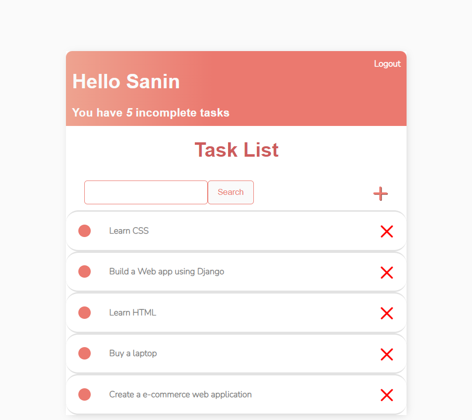
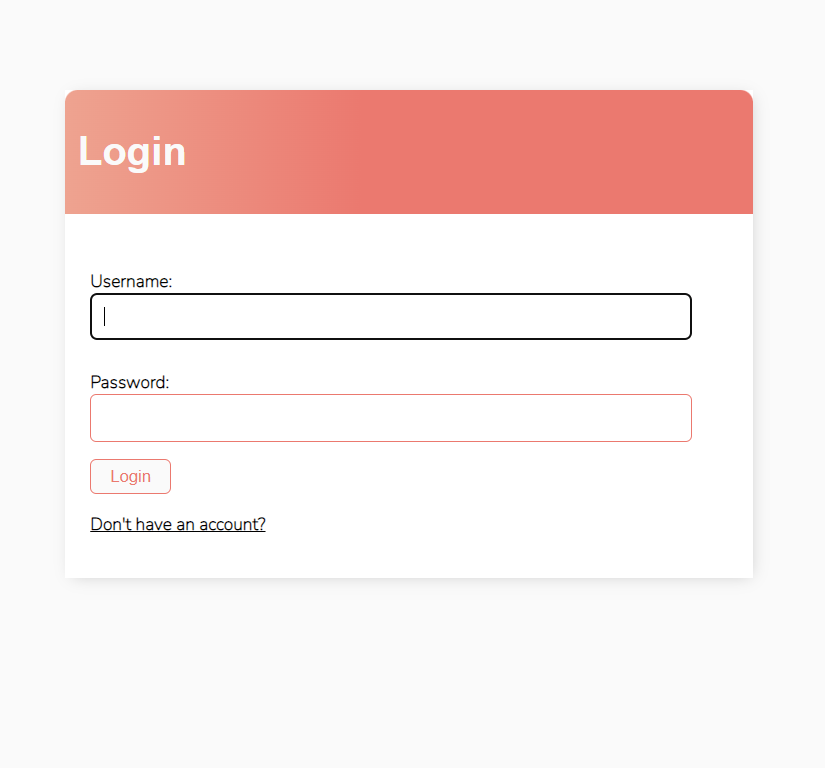
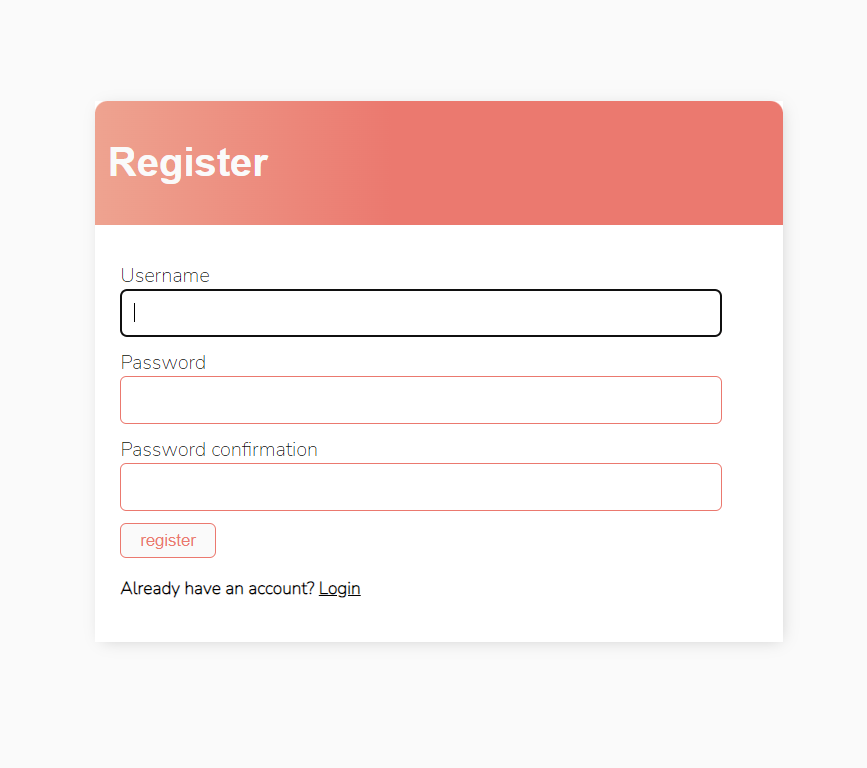
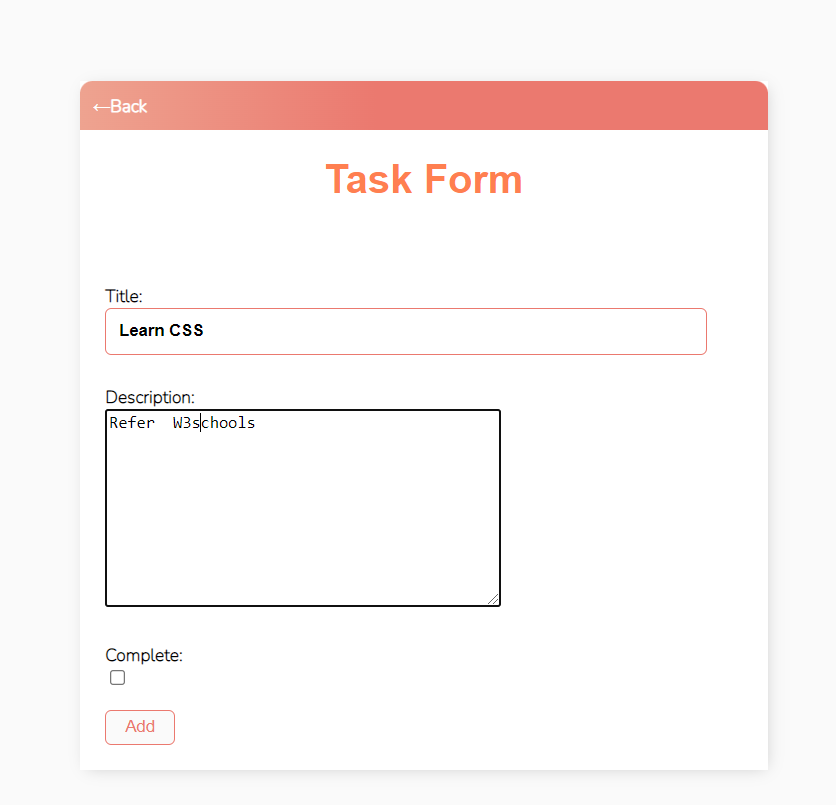

# ToDoApp-using-Django-sqlite3
This a simple and basic ToDoApp using Class views.
This includes User Login , User Registration , Delete Task, Update Task, Add Task , Mark as completed , Search , Logout 
 <a href="https://to---do--app.herokuapp.com/">Checkout Live web</a>
<h6>Link to youtube video :<a href="https://youtu.be/MXLBHePDLoY">  screen record</a></h6>

<h1>Pages included</h1>

<h4>1. Home</h4>

<h4>2. Login</h4>

<h4>3. Register</h4>

<h4>4. Update</h4>

